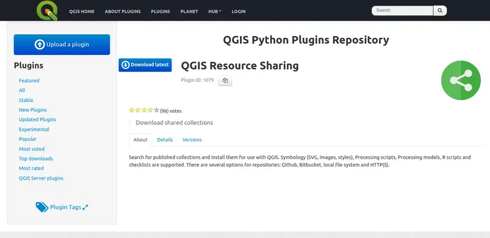
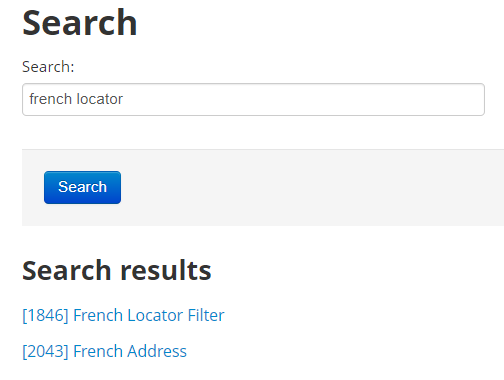
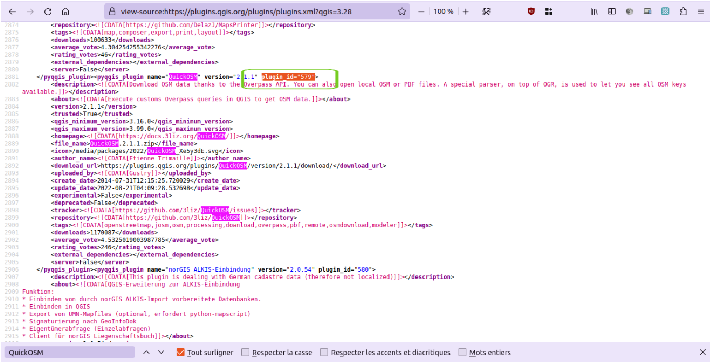

# How to get a plugin ID

To reference the [plugins used in a profile](../usage/profile.md#describe-and-prepare-your-qgis-profiles), the best way is to use their repository's ID.

## Method 1: on plugin's page

Since this [Feature request](https://github.com/qgis/QGIS-Django/issues/343) on QGIS official repository website has been accepted and deployed, there is a button below the plugin's title on its page to copy its ID:

## Method 2: in search results

1. Search for the plugin on QGIS plugin search page. Example for the official set on QGIS 3.28: <https://plugins.qgis.org/search>
2. Identify the plugin you want in the search results list
3. The plugin ID is the number between brackets at the left of the plugin name

  

## Method 3: from repository source

> This method works for every plugins repository, not only the QGIS official one.

1. Open the repository in your browser. Example for the official set on QGIS 3.28: <https://plugins.qgis.org/plugins/plugins.xml?qgis=3.34>
1. Open the RAW mode (or source), typing `Ctrl + U` or right-click and  select `View page source`
1. Use your browser search `Ctrl + F` to look for the plugin you want
1. Grab the `plugin_id` attribute:

  
