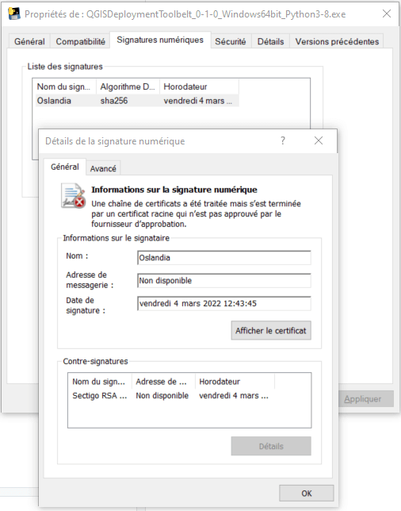

# How to sign the executable on Windows

## Self-signed certificate

:::{note}
Here is just a quick view. Read [the official documentation](https://docs.microsoft.com/en-us/windows/msix/package/create-certificate-package-signing).
:::

Requirements:

- Windows 10+
- Powershell > 5 (ideally 7+)
- the [`signtool.exe`](https://aka.ms/signtool) utility that can be installed along the [Windows 10 SDK](https://developer.microsoft.com/windows/downloads/windows-10-sdk/). Only the *Windows SDK Signing Tools for Desktop Apps* feature is required.

1. Create a self-signed certificate:

    ```powershell
    New-SelfSignedCertificate -Type Custom -Subject "CN=Oslandia, O=Oslandia, C=FR" -KeyUsage DigitalSignature -FriendlyName "QGIS Deployment Toolbelt" -CertStoreLocation "Cert:\CurrentUser\My" -TextExtension @("2.5.29.37={text}1.3.6.1.5.5.7.3.3", "2.5.29.19={text}")
    ```

1. Save the thumbprint into a variable:

    ```powershell
    $thumbprint = (Get-ChildItem Cert:\CurrentUser\My -Recurse | Where-Object { $_.FriendlyName -like "QGIS Deployment*" }).Thumbprint
    ```

1. Create a password to encrypt the certificate:

    ```powershell
    $pass = Read-Host "Enter Password" -AsSecureString
    ```

1. Export it with a password:

    ```powershell
    Export-PfxCertificate -cert "Cert:\CurrentUser\My\$thumbprint" -FilePath ssc_oslandia_qdeploymenttoolbelt.pfx -Password $pass
    ```

1. Sign it:

    :::{tip}
    Adapt the path to `signtool.exe` to your system (arch and SDK version) and the path to the executable.
    :::

    Try it with automatic mode:

    ```powershell
    & 'C:\Program Files (x86)\Windows Kits\10\bin\10.0.22000.0\x64\signtool.exe' sign /a /fd SHA256 /td SHA256 /tr http://timestamp.comodoca.com/rfc3161 .\dist\QGISDeploymentToolbelt_0-1-0_Windows64bit_Python3-8.exe
    ```

    You should see a message like:

    ```powershell
    Done Adding Additional Store
    Successfully signed: .\dist\QGISDeploymentToolbelt_0-1-0_Windows64bit_Python3-8.exe
    ```

    If you see an error, you can try again specifying the certificate to use and the password:

    ```powershell
    & 'C:\Program Files (x86)\Windows Kits\10\bin\10.0.22000.0\x64\signtool.exe' sign /a /fd SHA256 /f ssc_oslandia_qdeploymenttoolbelt.pfx /P $pass /td SHA256 /tr http://timestamp.comodoca.com/rfc3161  
    ```

Opening the properties of the executable, the related tab should look like this:


