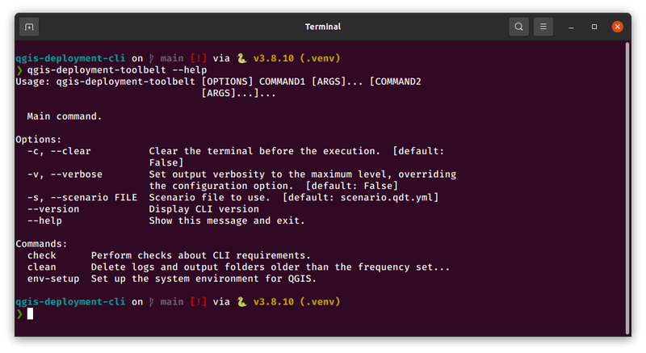

# {{ title }} (QDT) - Documentation

> **Description:** {{ description }}  
> **Author and contributors:** {{ author }}  
> **Version:** {{ version }}  
> **Source code:** {{ repo_url }}  
> **License:** {{ license }}  
> **Last documentation build:** {{ date_update }}

[](https://pypi.org/project/qgis-deployment-toolbelt/)
[](https://pypi.org/project/qgis-deployment-toolbelt/)
[](https://pypi.org/project/qgis-deployment-toolbelt/)

----



## What it is and the underlying philosophy

Development is leaded by the following principles and goals:

- a tailor-made tool for QGIS ecosystem
- open source and community driven
- independant from the QGIS installation mode
- packaged as CLI and prebuilt stand-alone binary
- cross-platform but with a strong focus on Windows
- documented
- tested
- usable with a single action (*one-click run*)
- easily reusable
- easily maintenable
- compatible with automation mechanisms:
    - cron / scheduled tasks
    - Windows [groups policies](https://en.wikipedia.org/wiki/Group_Policy) (so called GPO for *Group Policies Object*) and [tooling around client management](https://learn.microsoft.com/en-us/windows/client-management/)
- flexible enough to be adapted to an internal security policy (allowing to put a custom code certificate)

### It's not

- an installer for QGIS
- a packager helper

## Quickstart

### With Python

1. Get QDT executable:

    ```sh
    pip install -U qgis-deployment-toolbelt
    ```

    :::{important}
    It's not directly related to QDT but check that the Python scripts folder is declared in your `PATH` (list of folders where executables are authorized to run).
    :::

1. Run a scenario. For example the one which is shipped as demonstration in QDT project:

    ```sh
    qdt -s https://github.com/Guts/qgis-deployment-cli/raw/main/examples/scenarios/demo-scenario.qdt.yml
    ```

### With the stand-alone executable

> Typically on Windows

1. Download latest version that matches your environment from [releases](https://github.com/Guts/qgis-deployment-cli/releases/latest)
1. Rename it as `qdt.exe`
1. Open a terminal in the same folder
1. Run a scenario. For example the one which is shipped as demonstration in QDT project:

    ```sh
    ./qdt.exe -s https://github.com/Guts/qgis-deployment-cli/raw/main/examples/scenarios/demo-scenario.qdt.yml
    ```

----

## Table of contents

```{toctree}
---
caption: How to use
maxdepth: 1
---
usage/installation
usage/how_it_works
usage/how_to_use
usage/profile
usage/scenario
jobs/index
usage/cli
usage/settings
```

```{toctree}
---
caption: Guides
glob:
maxdepth: 1
---
guides/howto_validate_profiles_scenarios
guides/howto_behind_proxy
guides/howto_use_custom_ssl_certs
guides/howto_qgis_get_plugin_id
guides/howto_schedule_deployment
guides/howto_windows_sign_executable
guides/*
```

```{toctree}
---
caption: Miscellaneous
maxdepth: 1
---
misc/examples
misc/security
misc/compatibility
misc/credits
misc/funding
```

----

## Want to contribute?

```{toctree}
---
caption: Development
maxdepth: 1
---
Code documentation <_apidoc/modules>
development/contribute
development/ubuntu
development/windows
development/documentation
development/testing
development/packaging
development/releasing
development/history
```
