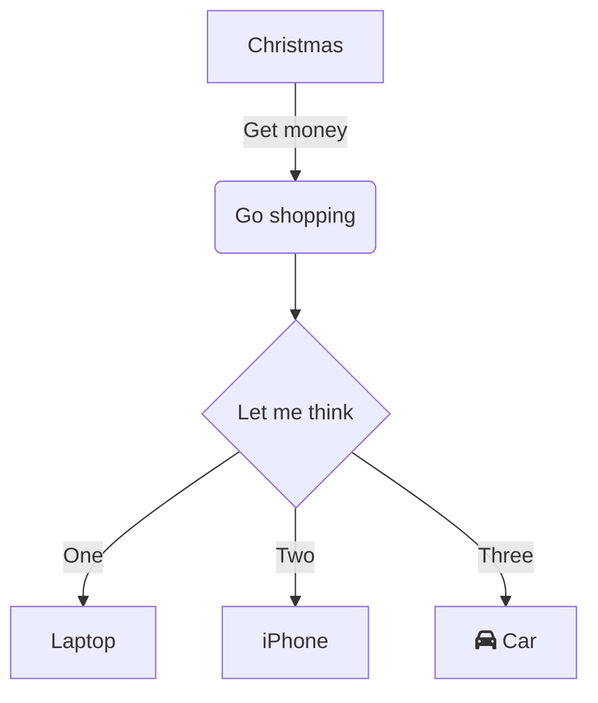

# Plugins manager

This job download plugins into QDT local folder and synchronize them with installed profiles.

----

## Use it

Sample job configuration in your scenario file:

```yaml
  - name: Synchronize plugins
    uses: qplugins-manager
    with:
      action: create_or_restore
```

----

## Options

### action

Tell the job what to do with plugins in **installed profiles**:

Possible_values:

- `create`: add plugins if they are not present
- `create_or_restore`: add plugins if not present and replace eventual existing one
- `remove`: remove plugins which are not listed

### force

Controls download mode.

Possible_values:

- `false` (_default_): download only plugins which are not present into the local QDT folder
- `true`: download every plugin referenced in profile.json files into the local QDT folder, even if the archive is already here

### threads

Number of threads to use for downloading.

Possible_values:

- `1`: do not use multi-thread but download plugins synchroneously
- `2`, `3`, `4` or `5` (_default_): number of threads to parallelize plugins download

----

## How does it work

### Specify the file to use in the `profile.json`

Add the image file to the profile folder and specify the relative filepath under the `splash` attribute:

```json
{
    [...]
    "plugins": [
        {
            "name": "french_locator_filter",
            "version": "1.0.4",
            "official_repository": true,
        },
        {
            "name": "pg_metadata",
            "version": "1.2.1",
            "url": "https://plugins.qgis.org/plugins/pg_metadata/version/1.2.1/download/",
            "location": "remote",
            "official_repository": true,
        },
        {
            "name": "Geotuileur",
            "version": "1.0.0",
            "url": "https://oslandia.gitlab.io/qgis/ign-geotuileur/geotuileur.1.0.0.zip",
            "location": "remote",
            "official_repository": false,
            "repository_url_xml": "https://oslandia.gitlab.io/qgis/ign-geotuileur/plugins.xml"
        }
    [...]
}
```

### Store the image file under the default path

If the path is not specified into the `profile.json`, the job looks for the default filepath `images/splash.png`. If the file exists, it will be used as splash screen image.

### Workflow

1. Create a subfolder `plugins` into the local QDT working directory. Default: `~/.cache/qgis-deployment-toolbelt/plugins`
1. Parse profiles downloaded by QDT (not the installed)
1. Create an unified list of used plugins
1. Download, if not already existing, every plugin into the plugins subfolder with this structure: `plugins/{plugin-name-slufigied}/{plugin-version}/{plugin-name-version}.zip`
1. Unzip plugins in installed profiles


