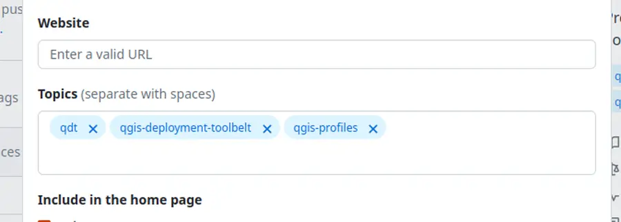
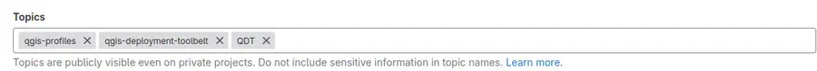

# Examples of QDT projects

Looking for inspiration? Want to see what others are doing with QDT?

::::{grid} 2
:gutter: 1

:::{grid-item}

```{button-link} https://github.com/topics/qgis-deployment-toolbelt
:color: primary
:expand:
:shadow:
:tooltip: Look for QDT projects on Github

{fab}`github` Search for QDT projects on Github
```

:::

:::{grid-item}

```{button-link} https://gitlab.com/explore/projects/topics/qgis-deployment-toolbelt
:color: primary
:expand:
:shadow:
:tooltip: Look for QDT projects on GitLab (SaaS)

{fab}`gitlab` Search for QDT projects on Gitlab
```

:::
::::

----

## Reference your project

Want to make your project appear here? Then, add some topics to your project!

### In Github

> See [upstream documentation](https://docs.github.com/en/repositories/managing-your-repositorys-settings-and-features/customizing-your-repository/classifying-your-repository-with-topics)

1. On your project homepage, click on  the  {octicon}`gear;1em;sd-text-info` icon on the right side
1. Add those keywords into the `Topics` field using autocompletion:

    - `qgis-deployment-toolbelt`
    - `QDT`
    - `qgis-profiles`



### In GitLab

> See [upstream documentation](https://docs.gitlab.com/ee/user/project/settings/)

1. Click on the `General` tab in `Settings` menu (or add `/edit` to your project URL)
1. Add those keywords into the `Topics` field using autocompletion (under the `Project name` field):

    - `qgis-deployment-toolbelt`
    - `QDT`
    - `qgis-profiles`


