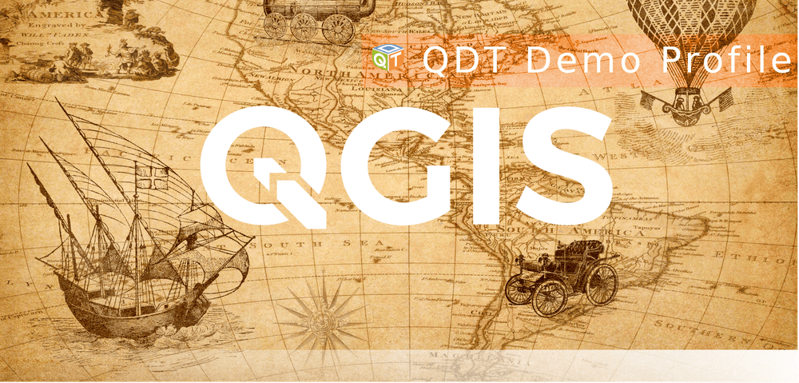

# Demonstration profiles to be deployed with QDT

This subfolder contains some QGIS profiles meant to be deployed using QDT.

## demo

Some of customizations to make it recognizable:

- locale is overridden with English/US
- theme is set to _Night Mapping_
- experimental plugins are enabled
- most of the default plugns are disabled except Processing
- at least one plugin is installed: [Profile Manager](https://plugins.qgis.org/plugins/profile-manager/)
- custom icon and splash screen


Splash screen:



As QDT developer, you might want to launch QGIS with this profile to edit or check it:

```sh
qgis --profile "demo" --profiles-path examples/
```

----

## Viewer Mode


As QDT developer, you might want to launch QGIS with this profile to edit or check it:

```sh
qgis --profile "Viewer Mode" --profiles-path examples/
```
